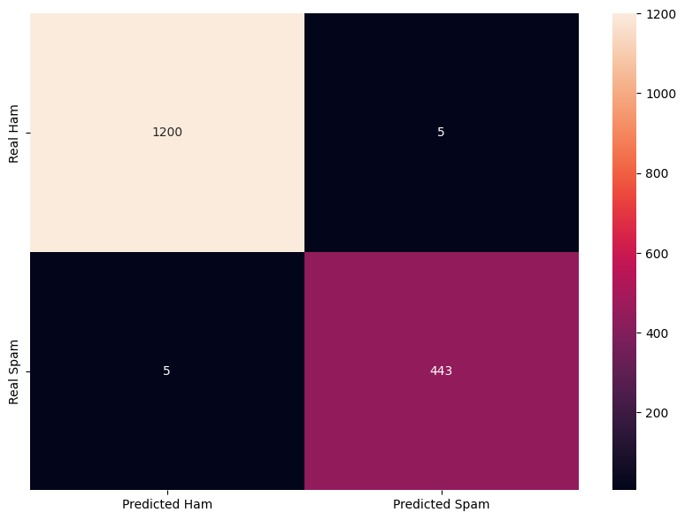

# Spam/Ham Email Classification using BERT

A spam detector using Bidirectional Encoder Representations.

## Install

```
$ pip install -r requirements.txt
```

## Results

Accuracy = 99.40%

Loss = 0.0176



## License

Apache License 2.0
